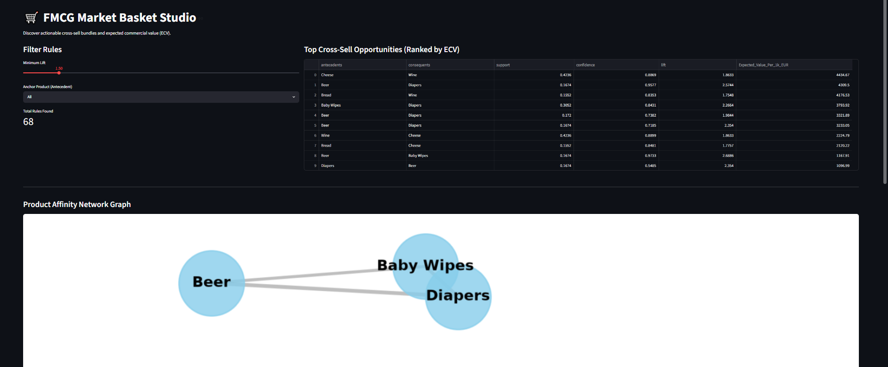
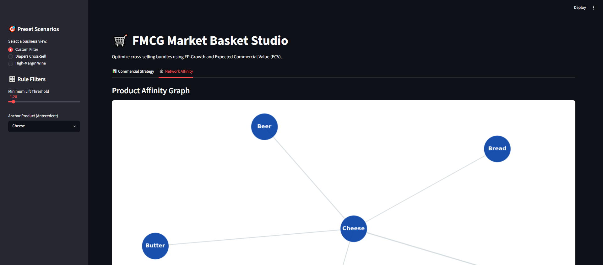

# 🛒 FMCG Market Basket Studio

[](https://www.python.org/downloads/)
[](https://github.com/astral-sh/ruff)
[](https://opensource.org/licenses/MIT)

Discover high-margin "frequently bought together" bundles for FMCG in minutes.

This repository provides an enterprise pipeline: raw transaction data → **FP-Growth** association rules → **Expected Commercial Value (ECV)** ranking → a Streamlit merchandiser dashboard and a FastAPI recommendation endpoint.




## 💼 The Commercial Strategy
Traditional algorithms prioritize statistical *Lift*, recommending highly associated items regardless of profitability. This engine introduces **ECV**, weighting conditional probability by unit margin to directly drive E-commerce gross margin.

* [📄 Read the Causal Strategy & Architecture](docs/BUSINESS_STRATEGY.md)
* [📥 Download the Executive Summary PDF](assets/executive_summary.pdf)

## 🚀 Quickstart (One-Command Demo)
The project utilizes `uv` for lightning-fast dependency resolution.

```bash
# 1. Sync dependencies (UI and API included)
uv sync --all-extras

# 2. Execute pipeline (Generates synthetic rules & ECV)
uv run python src/fmcg_basket/engine.py

# 3. Launch Dashboard
uv run streamlit run app/dashboard.py
```

## 💻 API Integration
Serve recommendations in real-time.

```Bash
uv run uvicorn api.main:app --reload
```

```Bash
curl -X GET 'http://localhost:8000/recommend/diapers?min_lift=1.2&top_n=3'
```

## 📂 Project Layout
* `src/fmcg_basket/engine.py`: Core FP-Growth frequent pattern mining.
* `src/fmcg_basket/metrics.py`: Expected Commercial Value (ECV) mathematics.
* `api/main.py`: Pydantic-validated FastAPI service.
* `app/dashboard.py`: Streamlit UI with NetworkX affinity graphs.
* `notebooks/`: Ingestion and rule mining demonstrations.

## 6. Community Docs
Create a new file `CONTRIBUTING.md` in the root folder.

## Contributing to FMCG Market Basket Studio

We use `uv` for dependency management and `pre-commit` to ensure code quality.

## Setup
1. Install dependencies: `uv sync --all-extras`
2. Install git hooks: `uv run pre-commit install`

## Testing & Linting
* Run Tests: `uv run pytest tests/`
* Run Linter: `uv run ruff check .`
* Compile Docs: `uv run python make_docs.py`
